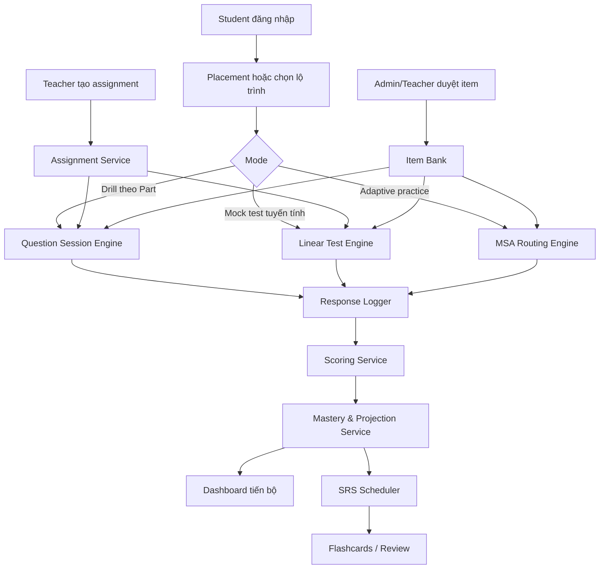
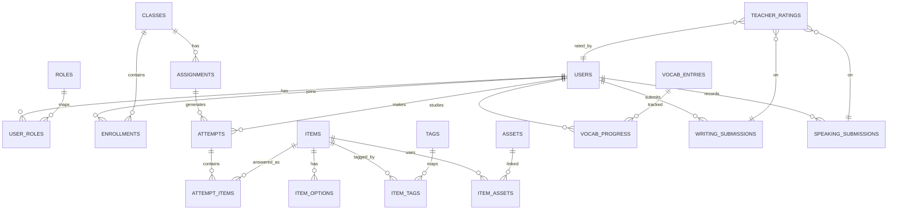

# Báo cáo nghiên cứu sâu về web app học tiếng Anh định hướng TOEIC 2026 với C# .NET 10 MVC và Blazor

## Tóm tắt điều hành

Một web app “TOEIC 2026–aligned” khả thi nhất về mặt học thuật và pháp lý không nên cố gắng “chép” bài thi ETS, mà nên bám sát ba lớp chuẩn công khai của TOEIC: cấu trúc bài thi và loại câu hỏi, các ngữ cảnh giao tiếp nơi làm việc và đời sống hằng ngày, cùng logic báo cáo điểm ở mức công khai. Theo tài liệu ETS và ETS Global, TOEIC Listening & Reading hiện vẫn là bài thi 200 câu trong 2 giờ cho bản tuyến tính, gồm 4 phần nghe và 3 phần đọc; đồng thời ở một số thị trường còn có biến thể multistage adaptive cho Listening và Reading, trong đó Unit 2 phụ thuộc kết quả Unit 1. Tài liệu nghiên cứu của ETS về bản cập nhật gần đây cho thấy bài thi được cập nhật để phản ánh cách dùng tiếng Anh hiện đại hơn như tin nhắn/chat và nhấn mạnh mạnh hơn vào kết nối thông tin, nhưng không thay đổi thang điểm, độ khó tổng thể, số câu hay thời lượng. Không có dấu hiệu công khai nào cho thấy một “định dạng TOEIC 2026” hoàn toàn mới đã thay thế nền tảng đó; vì vậy, “aligned 2026” nên được hiểu là bám theo các tài liệu TOEIC công khai còn hiệu lực đến năm 2026. citeturn2view0turn2view3turn31view0turn22search7turn33view0

Về sản phẩm, kiến trúc phù hợp nhất là **ASP.NET Core MVC làm khung tổ chức nghiệp vụ và routing**, kết hợp **Blazor Web App** cho những khu vực cần tương tác giàu trạng thái như trình làm bài có timer, review panel, adaptive routing, dashboard tiến bộ và player nghe. Cách kết hợp này hợp logic với .NET 10 vì .NET 10 đang là bản LTS được hỗ trợ đến tháng 11/2028; ASP.NET Core 10 bổ sung các cải tiến hữu ích cho Blazor, OpenAPI và Identity, trong đó có passkey/WebAuthn nếu muốn đi xa hơn ở lớp xác thực. citeturn29view0turn29view2turn28search1turn28search2turn15search3

Về chấm điểm, app nên tách bạch rõ giữa **điểm ước lượng nội bộ** và **điểm TOEIC chính thức**. ETS công khai rằng điểm TOEIC Listening/Reading là scaled score, được equating từ raw score; raw score và bảng quy đổi không công bố, và câu hỏi/đáp án chính thức được bảo vệ bản quyền. Do đó, app chỉ nên xuất “Projected TOEIC Band” hoặc “Estimated TOEIC Range”, dựa trên item bank riêng đã hiệu chuẩn nội bộ theo blueprint và anchor tests; không nên dùng ngôn ngữ gây hiểu nhầm rằng đây là điểm ETS chính thức. citeturn9view0

Về nội dung, chiến lược an toàn nhất là **soạn ngân hàng câu hỏi riêng** dựa trên blueprint công khai của ETS, kết hợp SME review, teacher moderation và sinh dữ liệu bằng AI có kiểm duyệt. Chỉ nên dùng tài liệu ETS ở mức tham chiếu định dạng, rubric và các sample công khai; không nên ingest hay tái phân phối câu hỏi ETS nếu không có giấy phép bằng văn bản. Với nội dung phụ trợ, có thể dùng nguồn mở có license rõ ràng như Tatoeba cho câu ví dụ văn bản, Princeton WordNet cho quan hệ từ vựng và Wikimedia Commons cho ảnh, nhưng phải lưu siêu dữ liệu cấp phép ở cấp từng asset. citeturn5view0turn20view0turn9view0turn34search0turn34search1turn34search2turn34search8

Khuyến nghị chiến lược là chia sản phẩm làm hai pha. **MVP** tập trung vào Listening/Reading, luyện Part-based, mock test tuyến tính, sổ từ vựng, grammar drills, dashboard tiến bộ và teacher assignment. **Full product** mới thêm adaptive engine kiểu multistage, speaking/writing practice có rubric, AI-assisted feedback, ngân hàng nội dung có kiểm định và báo cáo tổ chức. Với giả định một nhóm nhỏ full-stack có QA bán thời gian, MVP hợp lý ở mức khoảng **24–30 person-weeks**, còn full product ở mức **55–75 person-weeks**. Đây là ước lượng thiết kế sản phẩm, không phải số liệu công khai. 

## Cơ sở TOEIC 2026 và giả định thiết kế

TOEIC Listening & Reading theo tài liệu ETS là bài thi trắc nghiệm gồm hai phần thời gian riêng: Listening 45 phút và Reading 75 phút, mỗi phần 100 câu. Cấu trúc chuẩn hiện hành là Part 1 Photographs 6 câu, Part 2 Question-Response 25 câu, Part 3 Conversations 39 câu, Part 4 Talks 30 câu, Part 5 Incomplete Sentences 30 câu, Part 6 Text Completion 16 câu và Part 7 Reading Comprehension 54 câu. ETS cũng nhấn mạnh đây là bài thi workplace English, không đòi hỏi kiến thức chuyên môn hay từ vựng kỹ thuật quá chuyên sâu ngoài mức dùng trong hoạt động công việc hằng ngày. Trang IIG Việt Nam — đối tác tổ chức TOEIC tại Việt Nam — công bố cùng cấu trúc đó bằng tiếng Việt, rất hữu ích để nội địa hóa yêu cầu sản phẩm. citeturn2view0turn2view3turn19view0turn32view0

ETS đã cập nhật TOEIC Listening & Reading để phản ánh cách giao tiếp hiện đại hơn, như text messaging, instant messaging và việc kết nối thông tin giữa nhiều nguồn; nghiên cứu chính thức của ETS nêu rõ vẫn giữ nguyên tổng thời lượng, số câu, độ khó tổng thể và thang điểm. Tại Việt Nam, IIG cũng công bố việc triển khai cập nhật cấu trúc từ năm 2019 với cùng tinh thần đó. Điều này rất quan trọng cho thiết kế sản phẩm: app không nên “đóng khung TOEIC là email + memo kiểu cũ”, mà phải sinh bài tập dựa trên định dạng giao tiếp hiện đại của workplace English. citeturn31view0turn22search7

Ngoài bản tuyến tính 2 giờ, ETS Global và handbook 4-skills công bố một **multistage adaptive** version cho Listening và Reading trong một số bối cảnh: mỗi kỹ năng có Unit 1 chung cho mọi người học và Unit 2 được định tuyến theo kết quả Unit 1. Với Listening MSA, tổng 45 câu trong khoảng 25 phút; với Reading MSA, tổng 45 câu trong khoảng 37 phút. Đây là cơ sở rất mạnh để thiết kế một adaptive engine nội bộ “kiểu TOEIC”, dù thuật toán chấm điểm/định tuyến chi tiết của ETS không được công bố. citeturn10view0turn33view0turn17search0

TOEIC Speaking và Writing là các bài thi riêng. Speaking có 11 câu hỏi trong khoảng 20 phút với thang điểm 0–200; Writing có 8 câu hỏi trong khoảng 60 phút với thang điểm 0–200. Handbook chính thức cho biết Speaking được chấm bởi certified ETS raters, với các task như read aloud, describe a picture, respond to questions, respond using information provided và express an opinion; Writing có write a sentence based on a picture, respond to a written request và write an opinion essay. Vì vậy nếu app có Speaking/Writing, cách bám chuẩn tốt nhất là dùng cùng task families và rubric thực hành, nhưng luôn gắn nhãn là **practice module**, không phải bài thi ETS chính thức. citeturn2view4turn7view0turn7view2

Các giả định dưới đây được dùng vì người dùng chưa chỉ định:

| Hạng mục | Giả định thiết kế |
|---|---|
| Nhóm người học | Sinh viên đại học, người mới đi làm và nhân sự đang cần TOEIC cho đầu ra/tuyển dụng tại Việt Nam |
| Dải mục tiêu | Chủ lực TOEIC 450–850; có nhánh foundation cho người thấp hơn |
| Ngôn ngữ giao diện | Tiếng Việt mặc định, kèm tiếng Anh cho nội dung học |
| Mô hình kinh doanh | Freemium B2C + license cho trung tâm/trường/doanh nghiệp |
| Vị thế pháp lý | Ứng dụng luyện thi/phát triển năng lực theo phong cách TOEIC; không tuyên bố là sản phẩm ETS hay thay thế kỳ thi ETS |
| Thiết bị | Web responsive, ưu tiên laptop; mobile dùng cho flashcards, drill, review |

Một giả định học thuật quan trọng nữa là **không tồn tại “danh sách từ vựng TOEIC chính thức” hay “syllabus ngữ pháp TOEIC chính thức” được ETS công bố theo dạng checklist cố định** trong các tài liệu chính thức được rà soát cho báo cáo này. ETS mô tả ngữ cảnh, ability claims, loại câu hỏi và mức độ workplace English; vì thế danh mục từ vựng/ngữ pháp trong báo cáo này là **danh mục mẫu suy ra từ blueprint ETS, sample tests, score descriptors và nghiên cứu học thuật liên quan**, chứ không phải tài liệu canon của ETS. citeturn32view0turn31view0turn5view0turn6view0

## Đặc tả học thuật và nội dung

### Ma trận tính năng bám theo TOEIC

Bảng dưới đây là ma trận đề xuất, tổng hợp từ cấu trúc TOEIC Listening & Reading, TOEIC Speaking/Writing, các ability claims trong nghiên cứu ETS về bài thi cập nhật và mapping CEFR/score descriptors của ETS Global. citeturn2view0turn31view0turn2view4turn7view0turn21view0

| Kỹ năng / phần | Dạng câu hỏi chính thức | Năng lực được đo | Tính năng app nên có | Dữ liệu cần |
|---|---|---|---|---|
| Listening Part 1 | Photographs | Nhận diện hành động, vị trí, vật thể, quan hệ trực quan–ngôn ngữ | Photo drill, distractor analysis, shadowing câu mô tả đúng/sai | Ảnh, script audio, lưới nhãn đối tượng/hành động |
| Listening Part 2 | Question-Response | Phản xạ hội thoại ngắn, ngữ dụng cơ bản, WH/Yes-No/statement response | Rapid response mode, lỗi bẫy đồng âm/từ khóa, replay có giới hạn | Audio ngắn, loại câu hỏi, intent label |
| Listening Part 3 | Conversations | Gist, purpose, detail, inference, multi-speaker tracking, graphic integration | Dialogue player, transcript reveal sau khi làm, note-free timed mode, question tagging | Audio, transcript, speaker roles, graphic assets |
| Listening Part 4 | Talks | Gist/detail trong thông báo, voicemail, briefing, presentation ngắn | Talk player, timeline marker, summary prediction | Audio, transcript, discourse markers |
| Reading Part 5 | Incomplete Sentences | Grammar và vocabulary trong workplace texts | Grammar clinic, error-type analytics, spaced review theo lỗi | Item bank với grammar tag, lexical family |
| Reading Part 6 | Text Completion | Cohesion, discourse flow, grammar + từ vựng trong đoạn | Gap-fill đoạn, sentence insertion rationale | Đoạn văn, gap type, discourse relation |
| Reading Part 7 | Single/Multiple Passages | Locate info, connect across sentences/texts, infer, scan, integrate sources | Timed reading lab, annotation gỡ bỏ dần, compare-passages mode | Passage sets, metadata source type |
| Speaking | 11 tasks | Pronunciation, intonation, grammar, vocabulary, cohesion, relevance, completeness | Practice recorder, teacher rubric, AI-assisted feedback không-chính-thức | Prompt, audio transcript, rubric |
| Writing | 8 tasks | Grammar, relevance, text organization, adequacy of response | Email reply lab, opinion writing lab, rubric + sample answers | Prompt, rubric, model answer bands |

### Tiến trình độ khó

ETS định vị TOEIC Listening & Reading là phép đo workplace English từ trung cấp đến nâng cao, còn TOEIC Bridge phù hợp hơn với người học từ A1 đến B1; bảng mapping của ETS Global còn ghi rõ với A1–B1, ETS khuyên cân nhắc TOEIC Bridge. Vì vậy, tiến trình sản phẩm hợp lý nên chia làm bốn tầng: **Foundation**, **Core TOEIC**, **Target Score**, **High Score/Refinement**. citeturn3search0turn21view0

| Tầng | CEFR / band tham chiếu | Mục tiêu app | Dạng nội dung |
|---|---|---|---|
| Foundation | A1–A2 | Lấp khoảng trống trước TOEIC thật | Từ vựng cơ bản, câu đơn, nghe rất ngắn, reading micro-texts |
| Core TOEIC | B1 | Vào được format TOEIC chính | Part drills có giải thích, từ vựng theo chủ đề workplace |
| Target Score | B2 | Đạt 550–785 | Mixed sets, timed sets, Part 3/4/7 nhiều hơn, inference và paraphrase |
| High Score | C1 hướng 945+ | Tối ưu hóa tốc độ + độ bền | Multi-passage khó, implied meaning, uncommon grammar/vocab, stress management |

Nghiên cứu chính thức của ETS về bài thi cập nhật cho thấy Listening hiện nhấn mạnh hơn vào Short Conversations, Reading nhấn mạnh hơn vào Reading Comprehension/Text Completion, và có thêm trọng tâm về pragmatic understanding cũng như kết nối thông tin đa nguồn. Vì vậy đường phát triển độ khó trong app không nên đơn giản là “tăng độ khó từ vựng”, mà phải tăng dần các trục sau: mức paraphrase, độ gián tiếp của phản hồi hội thoại, yêu cầu liên kết nhiều câu/nhiều nguồn, mật độ distractor gần nghĩa, và tốc độ xử lý thời gian. citeturn31view0

### Chấm điểm và adaptive algorithm

Phần công khai của logic chấm TOEIC khá rõ: ETS cho biết điểm Listening và Reading dựa trên số câu đúng nhưng được chuyển sang scaled score bằng statistical equating; raw score không báo cho thí sinh, bảng quy đổi không công bố, không có penalty cho đoán mò, và total score là tổng Listening + Reading. Thang điểm công khai là 5–495 cho từng phần Listening/Reading và 10–990 cho tổng điểm; Speaking/Writing là 0–200 mỗi kỹ năng. citeturn9view0turn2view4turn7view2

Vì vậy, app nên dùng kiến trúc chấm điểm hai lớp:

| Lớp điểm | Mục đích | Cách hiển thị | Có thể dùng chính thức không |
|---|---|---|---|
| Raw practice score | Phản hồi tức thời trong drill/mock | 78/100, accuracy %, time/item | Có, như score nội bộ |
| Estimated proficiency | Theo dõi tiến bộ ổn định hơn | B1/B2/C1; theta hoặc mastery band | Có, như chỉ báo học tập |
| Projected TOEIC range | Gần ngôn ngữ người dùng muốn | Ví dụ 620–680 projected | Không phải điểm ETS chính thức |
| Official TOEIC score | Do ETS cấp | Không được app tự gán | Không |

Khuyến nghị adaptive engine cho app là **multistage adaptive nội bộ** thay vì full CAT ngay từ đầu. Lý do là lại gần cách ETS Global đang triển khai công khai, đồng thời kiểm soát được blueprint nội dung tốt hơn. Thiết kế đề xuất:

| Thành phần | Khuyến nghị |
|---|---|
| Routing stage | Unit 1 chung cho mọi người học, 20–25 câu mỗi kỹ năng |
| Ước lượng năng lực | Rasch/2PL hoặc simplified Bayesian mastery theo skill-tag |
| Unit 2 | Chia 3 nhánh easy / medium / hard, nhưng vẫn giữ quota part/ability-claim |
| Ràng buộc nội dung | Không cho adaptive phá vỡ blueprint theo part, chủ đề, grammar tag |
| Báo cáo | skill radar + score projection + weak tags |
| Recalibration | Anchor forms hàng tháng, kiểm tra DIF theo cohort |

Cần nói thẳng trong sản phẩm rằng đây là **TOEIC-style adaptive practice**, không phải thuật toán chính thức của ETS. Lựa chọn multistage là hợp lý vì ETS mô tả MSA như một mô hình trong đó mọi người học cùng làm stage đầu, rồi được điều hướng sang stage sau theo kết quả; tài liệu kỹ thuật của ETS về MSA cũng nhấn mạnh lợi ích về measurement accuracy và content coverage. citeturn10view0turn33view0turn17search0

### Nguồn nội dung và licensing

Rủi ro lớn nhất của một app TOEIC thương mại là **bản quyền câu hỏi**. ETS nêu rất rõ rằng test items và answer keys của TOEIC được bảo vệ bởi luật bản quyền và không được công bố hay sử dụng nếu không có written permission từ ETS. Đồng thời, ETS/ETS Global bán hoặc cấp các tài nguyên chuẩn bị thi chính thức như sample tests, Official Learning and Preparation Course, sách và TOEIC Test app với 700 câu hỏi chính thức cùng 80 bài ngữ pháp. Đây là nguồn tham chiếu và benchmark tuyệt vời, nhưng **không đồng nghĩa với quyền tái phân phối vào app của bên thứ ba**. citeturn9view0turn5view0turn20view0turn20view1

Chiến lược nội dung nên theo thứ tự ưu tiên sau:

| Nguồn | Dùng để làm gì | Rủi ro pháp lý | Khuyến nghị |
|---|---|---|---|
| ETS official public docs/sample tests | Blueprint, định dạng, rubric, QA checklist | Thấp nếu chỉ tham chiếu; cao nếu sao chép item | Bắt buộc dùng làm chuẩn đối chiếu |
| Nội dung tự biên soạn bởi SME/giáo viên | Item bank sản xuất thật | Thấp | Nguồn cốt lõi nên đầu tư |
| AI-generated drafts + human review | Tăng tốc authoring | Trung bình về chất lượng; thấp về bản quyền nếu prompt/nguồn sạch | Chỉ dùng như draft, buộc qua editorial QA |
| Tatoeba sentences | Ví dụ câu và micro-dialogues văn bản | Thấp nếu ghi attribution đúng | Dùng cho ví dụ/flashcards, không dùng nguyên xi làm mock test “official style” quá đậm |
| Princeton WordNet | Synonyms, lexical families, distractor candidates | Thấp | Dùng cho lexical graph, hinting, distractor generation |
| Wikimedia Commons | Ảnh cho photo prompts và minh họa | Thấp–trung bình vì phụ thuộc license từng file | Chỉ ingest asset đã kiểm license per-file |
| Scrape website luyện thi bên ngoài | Câu hỏi có sẵn | Cao | Tránh |

Về license phụ trợ, Tatoeba công bố câu văn bản mặc định theo CC BY 2.0 FR, WordNet của Princeton cho phép dùng thương mại theo license của họ, và Wikimedia Commons cho phép tái sử dụng phần lớn nội dung nhưng với điều kiện license cụ thể theo từng tệp. Đây là ba nguồn mở đáng cân nhắc cho lớp nội dung phụ trợ, nhưng app bắt buộc phải lưu `LicenseType`, `AttributionText`, `SourceUrl`, `Author`, `ProofOfRights` ở mức asset/item. citeturn34search0turn34search1turn34search2turn34search8

### Danh mục từ vựng và ngữ pháp mẫu bám TOEIC

ETS cho biết câu hỏi TOEIC được phát triển từ mẫu ngôn ngữ nói và viết thu thập từ nhiều quốc gia nơi tiếng Anh được dùng trong công việc; các chủ đề điển hình gồm corporate development, finance, offices, personnel, purchasing, technical areas, travel và nhiều bối cảnh đời sống thường nhật. ETS Global cũng mô tả ngôn ngữ của TOEIC là international English, tránh low-frequency, esoteric và highly technical vocabulary. citeturn32view0turn33view0

Nghiên cứu học thuật về lexical targets cho TOEIC gợi ý rằng để đạt mức bao phủ 98% từ chạy trong official practice materials, người học Nhật trong nghiên cứu cần lấp thêm khoảng trống từ vựng đáng kể; bài báo gợi ý thêm khoảng 1.000 word families cho listening và 2.000–3.000 cho reading so với nền 3.000 word families. Đây không phải chuẩn ETS, nhưng rất hữu ích để thiết kế roadmap từ vựng và spacing engine. citeturn24view0

Ngoài ra, nghiên cứu CALL về spaced repetition cho thấy việc ôn mục từ bằng cơ chế lặp giãn cách có thể cải thiện mạnh độ giữ lâu dài; một nghiên cứu double-blind báo cáo retention tăng gấp ba khi người học sử dụng hệ thống spaced repetition rất ngắn mỗi ngày, và một nghiên cứu khác cho thấy interleaved spaced repetition giúp cải thiện cân bằng giữa meaning/form/use. Điều này hỗ trợ mạnh cho quyết định đưa SRS vào nền tảng luyện TOEIC, đặc biệt cho Part 5/6 và pre-listening vocabulary. citeturn25view0turn25view1

Danh mục mẫu đề xuất:

| Cụm chủ đề | Từ vựng mẫu |
|---|---|
| Office & administration | schedule, deadline, reschedule, agenda, memorandum, stationery, supervisor, department |
| Recruitment & HR | applicant, candidate, vacancy, qualification, recruit, orientation, promotion, salary |
| Sales & marketing | brochure, discount, campaign, customer feedback, launch, retailer, warranty, revenue |
| Purchasing & logistics | shipment, invoice, supplier, delivery, warehouse, inventory, reorder, customs |
| Finance | budget, expense, reimbursement, outstanding balance, account, payment due, transaction |
| Meetings & presentations | conference room, attendee, presentation, proposal, minutes, keynote, summarize |
| Travel & hospitality | reservation, boarding pass, itinerary, check-in, cancellation, shuttle, availability |
| Technical & operations | device, maintenance, installation, malfunction, specification, upgrade, quality control |

Danh mục ngữ pháp mẫu cho Part 5/6:

| Cụm ngữ pháp | Ví dụ mục tiêu học |
|---|---|
| Parts of speech | decide / decision / decisive / decisively |
| Verb forms & tenses | has submitted, will be delivered, was postponed |
| Subject–verb agreement | Each employee is…, The results are… |
| Passive voice | The package was shipped yesterday |
| Relative clauses | the report that was requested |
| Conditionals | If the order is delayed, … |
| Prepositions | responsible for, in charge of, on schedule |
| Conjunctions & transitions | although, therefore, meanwhile, in addition |
| Quantifiers & determiners | much/many, few/little, each/every |
| Pronouns & reference | it, they, those, which |
| Comparatives | more efficient, less expensive |
| Modal verbs | must, may, should, be able to |

## Kiến trúc ứng dụng .NET 10 MVC và Blazor

Cách tổ chức hợp lý nhất là một solution nhiều project theo hướng “modular monolith sạch”, trong đó MVC quản lý page flow và Areas, còn Blazor giải quyết UI tương tác phức tạp. ASP.NET Core MVC hỗ trợ Areas như một cơ chế chia nhóm chức năng lớn; ASP.NET Core cũng dùng built-in DI, Identity với EF Core data model, role-based và policy-based authorization. Blazor trong .NET 10 hỗ trợ SSR và interactivity trong cùng một mô hình, rất phù hợp cho test-taking UI. citeturn15search1turn15search4turn14search0turn14search12turn14search6turn15search2turn15search5turn15search11turn15search3

### Cấu trúc solution đề xuất

```text
src/
  Toeic.Web/
    Areas/
      Student/
      Teacher/
      Admin/
    Controllers/
    Views/
    Components/                 # Blazor components
    Filters/
    Middlewares/
    Program.cs
  Toeic.Application/
    Abstractions/
    Services/
    DTOs/
    Validators/
    Commands/
    Queries/
  Toeic.Domain/
    Entities/
    Enums/
    ValueObjects/
    Events/
  Toeic.Infrastructure/
    Persistence/
    Identity/
    Audio/
    Search/
    Storage/
    BackgroundJobs/
  Toeic.Contracts/
    ApiModels/
    OpenApi/
tests/
  Toeic.UnitTests/
  Toeic.IntegrationTests/
  Toeic.Web.UITests/
```

### Vai trò và vùng chức năng

| Vai trò | Quyền chính | Area/UI chính |
|---|---|---|
| Student | Học, làm bài, xem tiến bộ, flashcards, assignment | `Student` |
| Teacher | Tạo lớp, giao bài, duyệt AI draft, chấm speaking/writing, xem analytics lớp | `Teacher` |
| Admin | Quản trị item bank, license, user, audit, system config, moderation | `Admin` |

Khuyến nghị dùng **role-based authorization** cho quyền thô và **policy-based authorization** cho quyền tinh hơn, ví dụ “TeacherOnly”, “CanApproveContent”, “CanViewClassAnalytics”, “StudentOwnAttemptOnly”. Với nội dung Blazor, có thể dùng `AuthorizeView`; với MVC, dùng `[Authorize(Roles=...)]` hoặc policy. citeturn15search2turn15search14turn15search11

### Blazor component plan

| Component | Mục đích |
|---|---|
| `TestShell.razor` | Khung làm bài, timer, progress, nav |
| `ListeningPlayer.razor` | Player audio một lần / nhiều lần theo mode |
| `QuestionPanel.razor` | Render MCQ theo Part |
| `ReviewPanel.razor` | Đánh dấu review, unanswered, jump-to-item |
| `AdaptiveStageBanner.razor` | Hiển thị chuyển Unit 1 → Unit 2 |
| `ScoreProjectionCard.razor` | Projected band + CEFR + mastery |
| `WeaknessHeatmap.razor` | Lỗi theo grammar/vocab/topic/part |
| `SrsCardDeck.razor` | Flashcards và spaced repetition |
| `TeacherRubricPanel.razor` | Chấm speaking/writing với rubric |
| `ContentApprovalQueue.razor` | Admin/teacher duyệt item do AI/SME tạo |

### Lưu đồ hệ thống



### Mẫu code pattern khuyến nghị

ASP.NET Core 10 tiếp tục dùng built-in DI và controller constructor injection là pattern chuẩn. EF Core 10 là LTS và yêu cầu .NET 10 để build/run. citeturn14search0turn14search12turn29view1

```csharp
// Program.cs
using Microsoft.AspNetCore.Identity;
using Microsoft.EntityFrameworkCore;
using Toeic.Infrastructure.Persistence;
using Toeic.Infrastructure.Identity;
using Toeic.Application.Services;

var builder = WebApplication.CreateBuilder(args);

builder.Services.AddControllersWithViews();
builder.Services.AddRazorComponents().AddInteractiveServerComponents();

builder.Services.AddDbContext<AppDbContext>(options =>
    options.UseSqlServer(builder.Configuration.GetConnectionString("DefaultConnection")));

builder.Services
    .AddDefaultIdentity<AppUser>(options =>
    {
        options.SignIn.RequireConfirmedAccount = true;
        options.Password.RequiredLength = 10;
    })
    .AddRoles<IdentityRole>()
    .AddEntityFrameworkStores<AppDbContext>();

builder.Services.AddAuthorization(options =>
{
    options.AddPolicy("TeacherOnly", p => p.RequireRole("Teacher", "Admin"));
    options.AddPolicy("AdminOnly", p => p.RequireRole("Admin"));
});

builder.Services.AddScoped<IItemSelectionService, ItemSelectionService>();
builder.Services.AddScoped<IScoringService, ScoringService>();
builder.Services.AddScoped<IMasteryService, MasteryService>();
builder.Services.AddScoped<ISrsScheduler, SrsScheduler>();

var app = builder.Build();

app.UseAuthentication();
app.UseAuthorization();

app.MapStaticAssets();
app.MapRazorComponents<App>().AddInteractiveServerRenderMode();

app.MapControllerRoute(
    name: "areas",
    pattern: "{area:exists}/{controller=Home}/{action=Index}/{id?}");

app.MapDefaultControllerRoute();
app.Run();
```

Một pattern tốt cho miền nghiệp vụ là để `Application` chỉ biết interface, còn `Infrastructure` cài đặt. Chấm điểm, chọn item, adaptive routing, scheduling SRS và analytics nên là các service riêng biệt để kiểm thử được độc lập.

## Mô hình dữ liệu và API

Phần này là **đề xuất thiết kế nội bộ**, không phải schema của ETS. Nó được xây để hỗ trợ ba yêu cầu cốt lõi: item bank có metadata phong phú, engine làm bài có thể audit/replay, và analytics có khả năng đi ngược từ outcome về năng lực yếu theo part/topic/grammar. 

### ER diagram



### Bảng schema đề xuất

| Bảng | Mục đích | Cột chính | Quan hệ chính |
|---|---|---|---|
| `Users` | Hồ sơ người dùng | `Id`, `Email`, `DisplayName`, `UiLanguage`, `TargetScore`, `CurrentLevel` | 1-n với attempts, enrollments |
| `Roles` | Vai trò | `Id`, `Name` | n-n với users |
| `UserRoles` | Map user-role | `UserId`, `RoleId` | Users ↔ Roles |
| `Classes` | Lớp học | `Id`, `Name`, `TeacherId`, `StartDate` | 1-n với enrollments, assignments |
| `Enrollments` | Ghi danh lớp | `ClassId`, `UserId`, `Status` | Users ↔ Classes |
| `Items` | Ngân hàng câu hỏi | `Id`, `Part`, `Skill`, `Stem`, `Difficulty`, `CefrBand`, `AbilityClaim`, `Status`, `LicenseId` | 1-n với options, assets |
| `ItemOptions` | Đáp án lựa chọn | `Id`, `ItemId`, `Label`, `Text`, `IsCorrect`, `Rationale` | n-1 với items |
| `Tags` | Tag phân loại | `Id`, `Type`, `Code`, `DisplayText` | n-n với items |
| `ItemTags` | map item-tag | `ItemId`, `TagId` | Items ↔ Tags |
| `Assets` | Audio, image, passage file | `Id`, `Type`, `Uri`, `DurationMs`, `Source`, `LicenseText` | n-n với items |
| `ItemAssets` | map item-asset | `ItemId`, `AssetId`, `Purpose` | Items ↔ Assets |
| `Assignments` | Bài giao | `Id`, `ClassId`, `Title`, `Mode`, `StartAt`, `EndAt` | 1-n với attempts |
| `Attempts` | Lần làm bài | `Id`, `UserId`, `AssignmentId`, `Mode`, `StartedAt`, `SubmittedAt`, `RawScore`, `ProjectedScoreMin`, `ProjectedScoreMax` | 1-n với attempt_items |
| `AttemptItems` | Log từng item | `AttemptId`, `ItemId`, `SelectedOptionId`, `IsCorrect`, `TimeSpentMs`, `Stage`, `SequenceNo` | n-1 với attempts/items |
| `MasterySnapshots` | Ảnh chụp năng lực | `Id`, `UserId`, `Skill`, `Part`, `Topic`, `MasteryScore`, `AsOfDate` | n-1 với users |
| `VocabEntries` | Kho từ vựng | `Id`, `Lemma`, `Pos`, `MeaningVi`, `Example`, `Topic` | 1-n với progress |
| `VocabProgress` | Tiến độ SRS | `UserId`, `VocabEntryId`, `EaseFactor`, `IntervalDays`, `NextReviewAt`, `LastResult` | Users ↔ VocabEntries |
| `SpeakingSubmissions` | Bài nói | `Id`, `UserId`, `PromptText`, `AudioUri`, `Transcript`, `PracticeBand` | 1-n với ratings |
| `WritingSubmissions` | Bài viết | `Id`, `UserId`, `PromptText`, `ResponseText`, `PracticeBand` | 1-n với ratings |
| `TeacherRatings` | Chấm rubric | `Id`, `TeacherId`, `TargetType`, `TargetId`, `RubricJson`, `Band`, `Feedback` | Teacher → speaking/writing |
| `Licenses` | Bản quyền nguồn | `Id`, `Name`, `RequiresAttribution`, `CommercialUseAllowed`, `Notes` | 1-n với items/assets |
| `AuditLogs` | Audit và moderation | `Id`, `ActorUserId`, `Action`, `EntityType`, `EntityId`, `CreatedAt` | n-1 với users |

### API endpoint đề xuất

Cũng như schema, bảng này là **thiết kế khuyến nghị** cho app.

| Endpoint | Method | Vai trò | Mục đích |
|---|---|---|---|
| `/api/auth/me` | GET | All | Lấy hồ sơ đăng nhập hiện tại |
| `/api/student/dashboard` | GET | Student | Tổng quan tiến bộ |
| `/api/tests/placement/start` | POST | Student | Bắt đầu placement |
| `/api/tests/{mode}/start` | POST | Student | Tạo session drill/mock/adaptive |
| `/api/tests/sessions/{sessionId}/next` | GET | Student | Lấy item tiếp theo |
| `/api/tests/sessions/{sessionId}/answer` | POST | Student | Gửi đáp án |
| `/api/tests/sessions/{sessionId}/submit` | POST | Student | Nộp bài |
| `/api/tests/attempts/{attemptId}` | GET | Student/Teacher | Xem kết quả chi tiết |
| `/api/tests/attempts/{attemptId}/review` | GET | Student/Teacher | Xem rationale và transcript sau nộp |
| `/api/vocab/review-queue` | GET | Student | Lấy danh sách SRS |
| `/api/vocab/{id}/grade` | POST | Student | Chấm recall chất lượng ôn |
| `/api/classes` | GET/POST | Teacher/Admin | Tạo và liệt kê lớp |
| `/api/classes/{classId}/assignments` | GET/POST | Teacher/Admin | Quản lý bài giao |
| `/api/content/items` | GET/POST | Teacher/Admin | Tìm kiếm / thêm item |
| `/api/content/items/{id}/approve` | POST | Admin | Phê duyệt item |
| `/api/content/licenses` | GET | Admin | Kiểm tra license catalog |
| `/api/speaking/submissions` | POST | Student | Nộp bài nói |
| `/api/writing/submissions` | POST | Student | Nộp bài viết |
| `/api/ratings/{targetType}/{targetId}` | POST | Teacher | Chấm rubric speaking/writing |
| `/api/analytics/class/{classId}` | GET | Teacher/Admin | Báo cáo lớp |
| `/api/admin/audit-logs` | GET | Admin | Audit hoạt động |

Nếu muốn tài liệu hóa API tốt hơn, .NET 10 có hỗ trợ OpenAPI 3.1 tốt hơn; đó là lựa chọn phù hợp để phát sinh tài liệu nội bộ cho teacher/admin và webhook integration. citeturn29view3

## Triển khai, kiểm thử và vận hành

### Xác thực, phân quyền và bảo mật

ASP.NET Core Identity là lựa chọn hợp lý nhất cho MVP vì nó quản lý user, password, roles, claims, tokens và profile data; mặc định đi rất tốt với EF Core. Với .NET 10, Identity còn hỗ trợ passkey/WebAuthn, nên full product có thể nâng cấp dần sang passwordless hoặc MFA chống phishing cho teacher/admin mà không phải thay nền xác thực. citeturn14search6turn14search2turn28search1turn28search2turn28search14

Khuyến nghị bảo mật thực tế:

| Hạng mục | MVP | Full product |
|---|---|---|
| Đăng nhập | Email + password + email confirmation | Passkey + MFA cho teacher/admin |
| Phân quyền | Roles + policies | Thêm resource-based authorization |
| Bảo vệ nội dung | Time-limited asset URLs | Watermarking/audit theo item |
| Nhật ký | Audit log moderation & login | Thêm anomaly detection |

### EF Core migrations và persistence

EF Core migrations là cơ chế chuẩn để tiến hóa schema theo mô hình code-first; EF Core CLI hỗ trợ tạo migration, apply migration và các tác vụ design-time. EF Core 10 là bản LTS, chạy trên .NET 10 và không chạy trên các .NET cũ hơn. citeturn14search5turn14search9turn29view1

Lệnh mẫu:

```bash
dotnet ef migrations add InitCore
dotnet ef database update

dotnet ef migrations add AddAdaptiveRouting
dotnet ef database update
```

Entity configuration nên đặt trong `Infrastructure/Persistence/Configurations` và dùng Fluent API để khóa các ràng buộc quan trọng như unique index cho `Enrollment(ClassId, UserId)`, composite key cho `ItemTags`, và index cho `Attempts(UserId, SubmittedAt)`.

### Chiến lược kiểm thử

Microsoft phân biệt rõ unit tests và integration tests trong ASP.NET Core: unit test cho logic cô lập; integration test để xác nhận nhiều thành phần phối hợp đúng khi xử lý request. Với ứng dụng này, chiến lược tốt là “kim tự tháp thấp nhưng sắc”: unit test rất nhiều ở scoring/adaptive/SRS; integration test cho luồng đăng nhập, start test, answer, submit; UI smoke tests có chọn lọc cho timer, audio-play constraints, review panel và teacher rubric. citeturn14search3turn14search7

Đề xuất độ bao phủ:

| Lớp | Cần test gì |
|---|---|
| Unit tests | `ScoringService`, `RoutingService`, `SrsScheduler`, `ProjectionService`, validators |
| Integration tests | Auth flow, authorization, item retrieval, submit attempt, analytics query |
| Contract tests | API response shape cho frontend/teacher portal |
| UI smoke tests | Test-taking shell, timer expiry, adaptive stage transition, rubric save |
| Content QA tests | Duplicate detection, wrong-key detection, distractor validity, license completeness |

Nguyên tắc vàng là các thuật toán như projection/adaptive/SRS phải có test data cố định để tránh drift ngầm khi chỉnh mô hình.

### CI/CD và deployment

GitHub Actions hỗ trợ trực tiếp pipeline build và test cho .NET; Azure App Service cũng hỗ trợ triển khai từ GitHub Actions, kể cả deployment slot. Đây là stack CI/CD ít friction nhất cho một app .NET 10 web. citeturn27search0turn27search6turn27search1

Pipeline khuyến nghị:

```yaml
name: ci-cd

on:
  push:
    branches: [ main ]
  pull_request:

jobs:
  build-test:
    runs-on: ubuntu-latest
    steps:
      - uses: actions/checkout@v4
      - uses: actions/setup-dotnet@v4
        with:
          dotnet-version: '10.0.x'
      - run: dotnet restore
      - run: dotnet build --no-restore -c Release
      - run: dotnet test --no-build -c Release --collect:"XPlat Code Coverage"

  deploy-staging:
    if: github.ref == 'refs/heads/main'
    needs: build-test
    runs-on: ubuntu-latest
    steps:
      - uses: actions/checkout@v4
      - uses: actions/setup-dotnet@v4
        with:
          dotnet-version: '10.0.x'
      - run: dotnet publish src/Toeic.Web/Toeic.Web.csproj -c Release -o ./output
      - uses: azure/webapps-deploy@v3
        with:
          app-name: 'toeic-app'
          slot-name: 'staging'
          package: './output'
```

Về hosting, ASP.NET Core có thể chạy trên IIS/Windows, Linux với Nginx, hoặc container. Với sản phẩm giáo dục cần scale vừa phải, có ba lựa chọn tốt:

| Phương án | Khi nào nên chọn | Ghi chú |
|---|---|---|
| Azure App Service + Azure SQL | Team nhỏ, muốn PaaS, CI/CD nhanh | Dễ làm staging slot, autoscale vừa phải |
| Linux VM + Nginx + Kestrel | Muốn tối ưu chi phí, tự quản trị | Cần DevOps kinh nghiệm hơn |
| Container hóa + orchestrator | Khi cần scale team lớn/multi-service | Có thể đi sau khi tách monolith |

ASP.NET Core docs cũng nhấn mạnh mô hình host-and-deploy chung: publish app, có process manager và reverse proxy khi cần; trên IIS dùng ASP.NET Core Module, còn trên Linux thường ghép Nginx với Kestrel. .NET còn có hỗ trợ containerization với `dotnet publish` và Docker. citeturn26search3turn26search1turn26search6turn26search5turn26search7turn26search10

## UX/UI, lộ trình và backlog

### Component list cho UX/UI

Với sản phẩm TOEIC, UX quan trọng nhất không phải “đẹp”, mà là **giữ cảm giác thi thật nhưng vẫn hỗ trợ học**. Do đó nên có hai mode rõ rệt: `Exam Mode` và `Study Mode`.

| Màn hình | Thành phần cốt lõi |
|---|---|
| Trang chủ | CTA placement, plan học, score projection, lịch assignment |
| Dashboard cá nhân | Score trend, heatmap lỗi, CEFR/projection, streak, upcoming reviews |
| Test player | timer, question nav, mark for review, audio player, passage pane cố định |
| Review screen | correct/incorrect, rationale, transcript/passage annotation, grammar tag |
| Vocabulary lab | flashcards, due today, topic set, mastery ladder |
| Grammar clinic | error buckets, mini-lessons, targeted drills |
| Teacher class dashboard | class average, weak parts, completion, grade distribution |
| Content admin | item editor, asset/license checker, approval queue, duplicate detector |

Một wireframe tối giản cho test player:

```text
+--------------------------------------------------------------+
| Timer 34:12 | Part 3 | Q 41/100 | Mark for review [ ]       |
+----------------------------+---------------------------------+
| Audio / Transcript hidden  | Question                        |
| [Play] [Replay? mode dep.] | 41. Why is the woman calling?  |
|                            | A. ...                          |
| Graphic (if any)           | B. ...                          |
|                            | C. ...                          |
|                            | D. ...                          |
+----------------------------+---------------------------------+
| Prev | Next | Review Panel | Submit                         |
+--------------------------------------------------------------+
```

### Lộ trình phát triển

Ước lượng dưới đây dùng đơn vị **person-weeks**, với giả định 1 PM/BA bán thời gian, 2 full-stack .NET engineers, 1 QA/automation bán thời gian, 1 content lead/teacher consultant bán thời gian.

| Giai đoạn | Kết quả | Ước lượng |
|---|---|---|
| Discovery & blueprint | TOEIC spec matrix, content policy, UX flows, schema v1 | 2–3 pw |
| Core platform | Auth, roles, MVC Areas, DB schema, admin skeleton | 4–5 pw |
| LR learning engine | Drill theo Part, mock tuyến tính, review/rationale, analytics v1 | 6–8 pw |
| Teacher workflow | Classes, assignments, class analytics, content approval v1 | 4–5 pw |
| SRS + vocab/grammar | Flashcards, scheduler, grammar clinic, weak-tag linking | 3–4 pw |
| QA hardening + deploy | integration tests, CI/CD, staging, observability | 3–5 pw |

**Tổng MVP:** khoảng **24–30 person-weeks**.

Full product bổ sung:

| Hạng mục mở rộng | Kết quả | Ước lượng thêm |
|---|---|---|
| Adaptive MSA engine | Unit routing, calibration, projection service v2 | 6–8 pw |
| Speaking/Writing practice | recorder, rubric, teacher rating, AI assist | 8–10 pw |
| Content factory | AI draft + QA workflow + duplicate/quality scoring | 5–7 pw |
| Monetization/B2B | subscriptions, seats, invoicing, org dashboards | 5–7 pw |
| Observability & scale | caching, CDN, queue jobs, cost controls | 3–5 pw |
| UX polish & accessibility | a11y, localization, responsive optimization | 4–6 pw |

**Tổng full product:** khoảng **55–75 person-weeks**.

### Backlog ưu tiên

| Ưu tiên | Tính năng | Lý do |
|---|---|---|
| Must | Auth + roles + MVC Areas | Nền tảng quyền hạn |
| Must | Item bank L/R + tags + assets + license metadata | Nền tảng nội dung |
| Must | Drill theo Part + mock test tuyến tính | Giá trị học tập cốt lõi |
| Must | Dashboard tiến bộ + weak-tag analytics | Khác biệt so với kho đề tĩnh |
| Must | Teacher classes + assignments | Hỗ trợ B2B/B2E, retention |
| Should | SRS vocabulary + grammar clinic | Tăng học dài hạn, bám nghiên cứu spaced repetition |
| Should | Adaptive MSA practice | Khác biệt sản phẩm rõ ràng |
| Should | Content approval workflow | Bảo đảm chất lượng & pháp lý |
| Could | Speaking/Writing practice | Mở rộng 4 kỹ năng |
| Could | Passkey login | Nâng bảo mật cho teacher/admin |
| Won’t first | Tự chấm “official TOEIC score” | Không phù hợp pháp lý/học thuật |

## Phụ lục thực hành

### Prompt/template sinh câu hỏi TOEIC-style

Các prompt dưới đây dùng để **sinh bản nháp**. Quy trình an toàn là: AI draft → validator → human review → pilot stats → publish. Không nên publish trực tiếp nội dung do model sinh.

#### Meta-prompt chung

```text
Bạn là item writer cho ứng dụng luyện TOEIC-style, không được sao chép ETS.
Hãy tạo 1 câu hỏi gốc mới theo các ràng buộc:
- Skill: {{Listening|Reading|Speaking|Writing}}
- Part: {{1..7 hoặc SW task}}
- CEFR band: {{A2|B1|B2|C1}}
- Topic: {{office|travel|purchasing|finance|personnel|customer service}}
- Ability claim: {{gist|detail|inference|vocabulary|grammar|pragmatics|connect-across-texts}}
- Difficulty: {{easy|medium|hard}}
- English style: international workplace English, không dùng từ quá chuyên ngành hiếm
- Đầu ra JSON hợp lệ gồm:
  stem, options[], answerKey, rationale,
  tags{part, topic, grammar, vocabFamily, abilityClaim, cefr},
  commonDistractorReason,
  vietnameseExplanation
- Không dùng tên thương hiệu có thật, không dùng câu đã nổi tiếng, không nhắc ETS.
```

#### Prompt cho Listening Part 2

```text
Tạo 5 câu hỏi dạng Question-Response cho TOEIC-style Part 2.
Ràng buộc:
- 2 câu WH, 2 câu statement-response, 1 câu yes/no.
- Mỗi câu có 3 đáp án A/B/C.
- Đáp án sai phải sai vì: lệch thì, lệch ý định, bẫy từ khóa hoặc loại câu trả lời không phù hợp.
- Mức B1–B2.
- Xuất JSON array.
```

#### Prompt cho Reading Part 5

```text
Tạo 10 câu Part 5 dạng incomplete sentence.
Phân bổ:
- 3 câu part of speech
- 2 câu preposition/collocation
- 2 câu tense/voice
- 2 câu pronoun/determiner
- 1 câu conjunction/transition
Mỗi câu kèm grammarTag, difficulty, answerKey, rationale.
Phong cách workplace English tự nhiên.
```

#### Prompt cho Part 7 multiple passages

```text
Tạo 1 set Part 7 gồm:
- 1 email
- 1 text message thread
- 5 câu hỏi
Bao phủ các kỹ năng:
locate info, connect across texts, inference, purpose, vocabulary in context.
Mức B2.
Không dùng số liệu vô lý; giữ timeline nhất quán.
```

#### Prompt validator

```text
Bạn là QA reviewer cho item bank TOEIC-style.
Hãy kiểm tra item JSON đầu vào theo tiêu chí:
- only one best answer
- distractor plausibility
- consistency of dates, names, quantities
- grammar correctness
- CEFR and difficulty fit
- topic fit to workplace/common-life contexts
- no copyright red flags
Trả về:
valid: true/false
issues[]
revisedItem{}
```

### Mẫu từ vựng nhỏ

Đây là bộ từ do tôi biên soạn minh họa cho app, không phải danh sách chính thức của ETS.

| Lemma | Nghĩa Việt | Chủ đề | Gợi ý học |
|---|---|---|---|
| reschedule | dời lịch | meetings | đi với meeting, appointment |
| applicant | ứng viên | HR | gần với candidate nhưng khác ngữ cảnh |
| invoice | hóa đơn | purchasing | đối chiếu với receipt |
| warranty | bảo hành | sales | thường gặp trong Part 3/4 |
| shipment | lô hàng | logistics | hay đi với delay/arrival |
| reimbursement | hoàn chi phí | finance | hay đi với form/request |
| availability | tình trạng còn chỗ/còn hàng | travel/service | nhiều nghĩa theo ngữ cảnh |
| maintenance | bảo trì | technical | đối chiếu maintain |
| agenda | chương trình họp | office | Part 3/7 |
| outstanding | còn tồn/chưa thanh toán | finance | “outstanding balance” |
| promotion | thăng chức/khuyến mại | HR/sales | từ đa nghĩa cần cảnh giác |
| attendee | người tham dự | events | gần participant |
| revise | sửa đổi | office/writing | revise a draft/schedule |
| estimate | ước tính | finance/project | noun/verb |
| confirm | xác nhận | travel/service | hay gặp trong email |

### Bộ 10 câu hỏi mẫu

Các câu dưới đây là **câu gốc do tôi soạn** để minh họa dữ liệu seed và không phải câu ETS.

| ID | Part | Câu hỏi mẫu | Đáp án |
|---|---|---|---|
| Q1 | Part 1 | **[Mô tả ảnh]** Một kỹ thuật viên đang kiểm tra một máy photocopy mở nắp. A. The man is making copies of a report. B. The man is inspecting a machine. C. Some boxes are being loaded onto a truck. D. A customer is paying at a counter. | B |
| Q2 | Part 2 | Where should I leave the signed contract? A. On Ms. Tran’s desk. B. Yes, the contract was expensive. C. He signed it yesterday. | A |
| Q3 | Part 2 | The training session has been moved to Friday. A. I’ll update the calendar. B. It moved very quickly. C. Friday is a nice trainer. | A |
| Q4 | Part 3 | **Dialogue:** Woman: Hi, I’m calling because the sample order hasn’t arrived yet. Man: Let me check… It left our warehouse on Monday, so it should reach you this afternoon. Woman: Great. Could you email me the tracking number anyway? **Question:** What is the woman mainly concerned about? A. Returning a product B. Delayed delivery C. Changing a product design D. Scheduling a meeting | B |
| Q5 | Part 3 | Dựa trên đoạn hội thoại Q4, the man agrees to: A. issue a refund B. send a tracking number C. cancel the order D. offer a discount | B |
| Q6 | Part 4 | **Talk:** “Attention passengers for Flight KX218 to Singapore. Boarding will begin at Gate 12 in approximately ten minutes. Passengers needing extra assistance may approach the counter now.” **Question:** What are listeners asked to do now? A. Proceed directly onto the plane B. Go to Gate 10 C. Wait about ten minutes for boarding D. Pick up their luggage | C |
| Q7 | Part 5 | All expense reports must be submitted no later than Friday noon; ______, reimbursement may be delayed. A. otherwise B. for example C. meanwhile D. instead of | A |
| Q8 | Part 5 | The new assistant quickly adapted to the department’s filing ______. A. system B. systematic C. systematically D. systemsatize | A |
| Q9 | Part 6 | “Dear staff, the conference room on the third floor will be unavailable tomorrow morning because maintenance work is being carried out. Please use Room 2B for scheduled meetings. We apologize for any inconvenience.” **Gap question:** Which sentence best completes an announcement title? A. New Product Launch Postponed B. Temporary Room Change Notice C. Cafeteria Menu Update D. Parking Fee Reduction | B |
| Q10 | Part 7 | **Email excerpt:** “Please note that all visitors must register at reception before entering the warehouse area. Safety helmets will be provided on site.” **Question:** What is indicated about visitors? A. They must bring their own helmets. B. They may enter through the back door. C. They need to check in first. D. They can visit only after 6 p.m. | C |

### Giới hạn và câu hỏi mở

Báo cáo này bám rất sát tài liệu công khai của ETS, ETS Global, Microsoft và một số nghiên cứu học thuật, nhưng có ba giới hạn cần giữ rõ. Thứ nhất, thuật toán chấm scaled score chính thức của ETS không công khai; vì vậy mọi cơ chế “projected TOEIC score” trong app chỉ có thể là mô hình nội bộ. Thứ hai, ETS không công bố syllabus từ vựng/ngữ pháp chuẩn hóa thành checklist; các danh mục trong báo cáo là danh mục mẫu suy diễn có kiểm soát từ blueprint và nghiên cứu. Thứ ba, tài nguyên ETS chính thức có tính bản quyền cao; nếu muốn tích hợp nội dung ETS thực sự vào app thương mại, cần trao đổi licensing trực tiếp với ETS/EPN phù hợp. citeturn9view0turn32view0turn5view0turn20view0